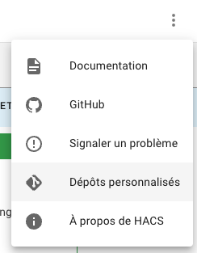
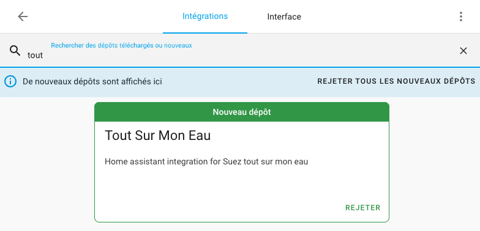
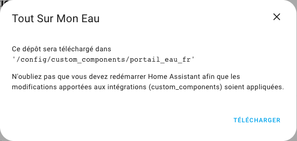
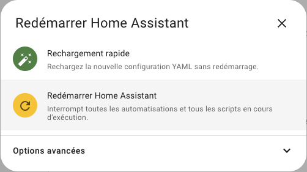
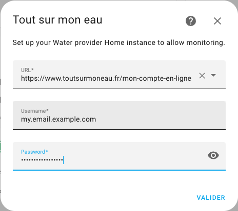
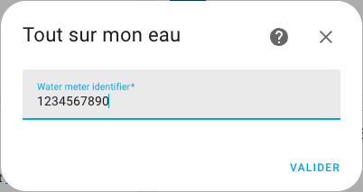

# Home Assistant Integration for toutsurmoneau and others

Version 0.0.5

Home assistant integration for Suez tout sur mon eau

## Installation

- Install HACS : <https://hacs.xyz/>
  Follow the guide: <https://hacs.xyz/docs/community_guides>

- In Home Assistant, navigate to HACS &rarr; Integrations, and then click on the menu:

  

- For the address enter this github address:

  <https://github.com/laurent-martin/hass_int_toutsurmoneau>

- Then, search: "tout"

  

- Then, click on Download:

  

  

- once done, restart home assistant

  

- Then, in Home Assistant, navigate to Settings &rarr; Integration and add integration, then search "tout"

- This starts the Configuration.

## Configuration

- First enter the provider URL, or select one of the provided URLs

  

- Enter username and password

- Then, the integration will discover the meter identifier, and propose it.
  (No need to inspect the web page source)

  

After that the integration is configured.

Note that the current version shows only the current meter index (absolute).
This can be used as "Water source" that can be monitored.

## To come

I plan to add the possibility to provision all available history back into Home Assistant.
